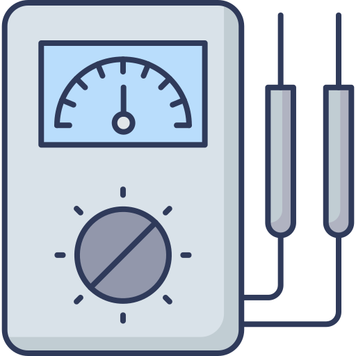

# ACS712_Hall
Arduino library for ACS Current Sensor Hall Effect- 5A, 20A and 30A models.

## License ##

This file is part of ACS712_Hall Library.

ACS712_Hall Library is free software: you can redistribute it and/or modify it under the terms of the GNU General Public License as published by the Free Software Foundation, either version 3 of the License, or (at your option) any later version.

ACS712_Hall Library is distributed in the hope that it will be useful, but WITHOUT ANY WARRANTY; without even the implied warranty of MERCHANTABILITY or FITNESS FOR A PARTICULAR PURPOSE.  See the GNU General Public License for more details.

You should have received a copy of the GNU General Public License along with ACS712_Hall Library.  If not, see <https://www.gnu.org/licenses/>.

## Authors ##

Copyright © 2021 Francisco Rafael Reyes Carmona.
Contact me: rafael.reyes.carmona@gmail.com

## Credits ##

Electric meter icon at the beginning is from [Flaticon.es](https://www.flaticon.es) designed by [DinosoftLabs
](https://www.flaticon.com/authors/dinosoftlabs)
and licensed by [free license](img/license-37862535.pdf).
